# Azure Databricks - Insights from a Platform Engineer:-

Your organization is embarking on the journey of building a "Data Platform." Naturally, a key question arises: which team within your organization will be responsible for this task? 
The immediate assumption might be the "Data Engineering Team." However, in my humble opinion, this isn't always the most accurate answer. 🧐

It's crucial to form the right team and clearly define roles and responsibilities from the outset. Doing so ensures that individuals remain motivated and committed to the project's success. 🙌
To illustrate this point, I've chosen Azure Databricks as an example for my speaker session.😊

I had the Privilege to talk on this topic in __TWO__ Azure Communities:-

| __NAME OF THE AZURE COMMUNITY__ | __TYPE OF SPEAKER SESSION__ |
| --------- | --------- |
| __Microsoft Azure Zurich User Group__ | __In-Person__ |
| __Microsoft Azure Bern User Group__ | __In-Person__ |

| __EVENT ANNOUNCEMENTS:-__ |
| --------- |
| 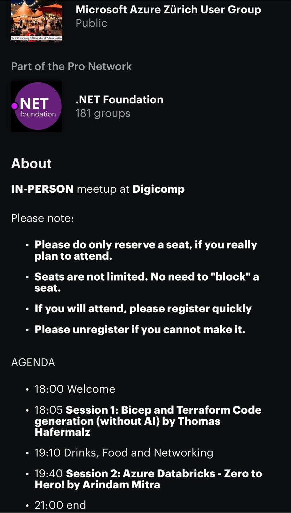 |
| __IN-PERSON SESSION:-__ |
| 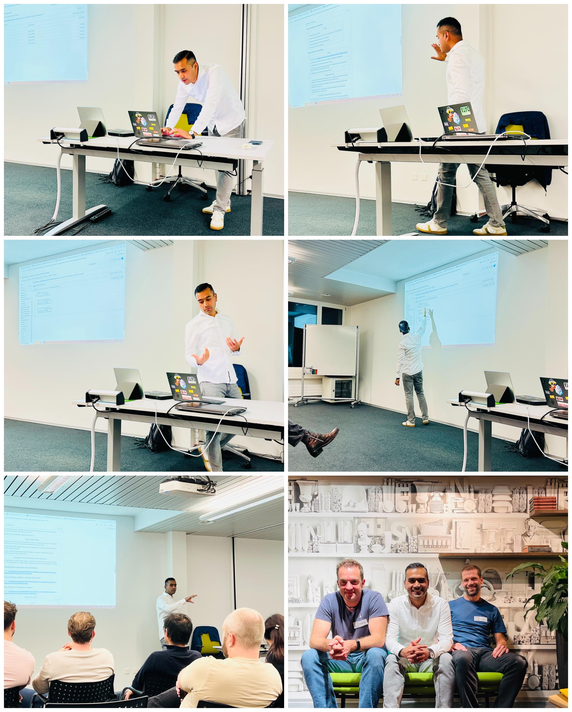 |
| __EVENT ANNOUNCEMENTS:-__ |
| 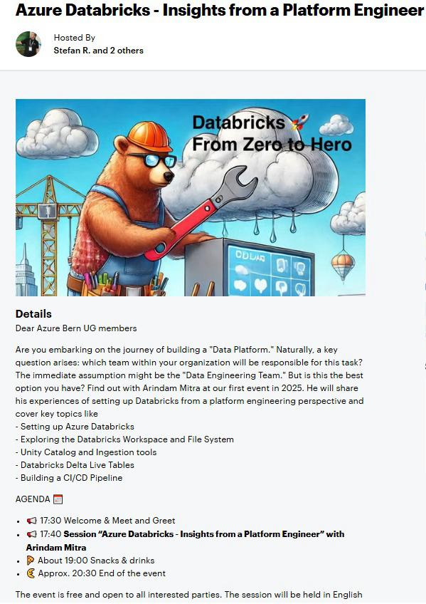 |

| __#__ | __Agenda__ |
| --------- | --------- |
| 1. | Lake House Medallion Architecture. |
| 2. | Other Architectures and Comparisons. |
| 3. | Teams Involved. |
| 4. | Summary Including the Flow of Teams Interactions. |
| 5. | ETL vs ELT. |
| 6. | Factors Contributing to Shift from ETL to ELT. |
| 7. | Azure Databricks Introduction. |
| 8. | Azure Databricks Networking. |
| 9. | Azure Databricks Deployment using Terraform. |
| 10. | Build a Spark Cluster and Run a Sample Notebook. |
| 11. | Mounting ADLSv2 to Databricks Cluster. |
| 12. | Workspace Backup. |
| 13. | Connector for Azure Databricks. |
| 14. | Pre-Requisites for Unity Catalog. |
| 15. | Unity Catalog. |
| 16. | Azure Databricks SCIM Connector. |
| 17. | AzureRM Provider for Azure Databricks. |
| 18. | Databricks Terraform Provider. |

## __Lake House Medallion Architecture:-__

| 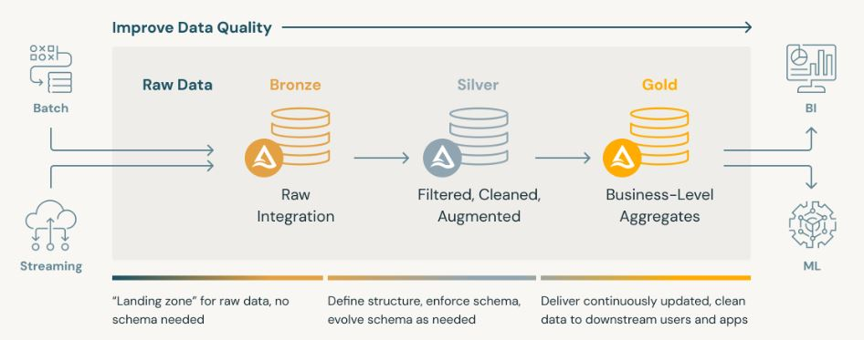 |
| --------- |

| __#__ | __Lake House Medallion Architecture Layers__ | __Details__ |
| --------- | --------- | --------- |
| 1. | Bronze | Raw Data is ingested in Bronze Layer. |
| 2. | Silver | Processed and Enriched in Silver Layer. |
| 3. | Gold | Aggregated and made ready for analytics in the Gold layer. |

## __Other Architectures and Comparisons:-__

| __#__ | __Architectures__ | __Diagram__ | __Details__ |
| --------- | --------- | --------- | --------- |
| 1. | Lambda | 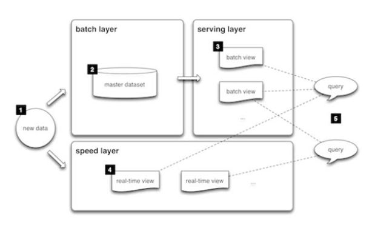 | Focuses on both batch and real-time streaming data. This Architecture represents 3 Layers:- i) __Batch Layer:__ Processes Batch Data; ii) __Speed Layer:__ Handles real-time data streams; iii) __Serving Layer:__ Combines results from the batch and speed layers to provide a unified view to end-users. |
| 2. | Kappa | 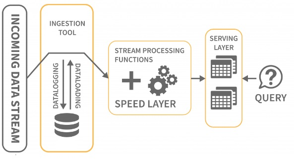 | Focuses only on real-time streaming data. This Architecture represents 2 Layers:- i) __Speed Layer:__ Handles real-time data streams; ii) __Serving Layer:__ A Unified view to end-users from the results of the Speed layer. |
| 3. | Data Lakehouse | 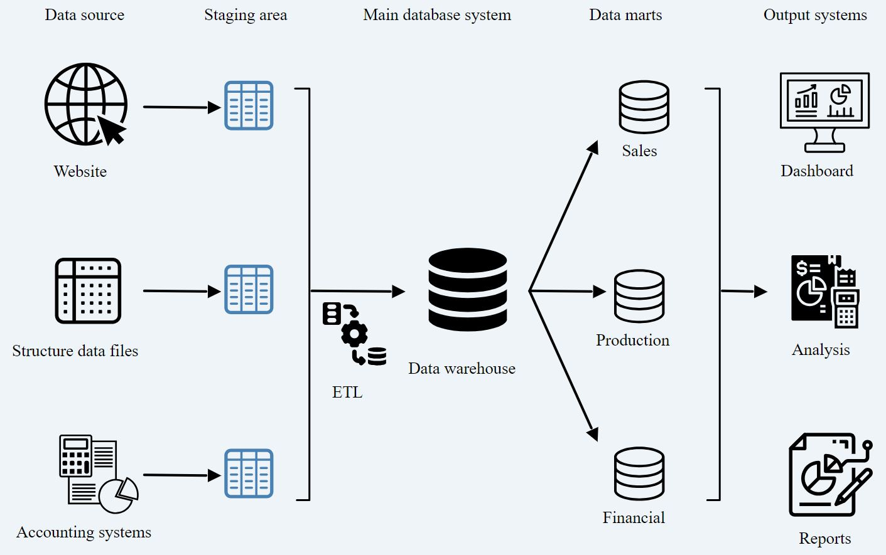 | - |
| 4. | Ingestion to Consumption Architecture (ETL/ELT) | 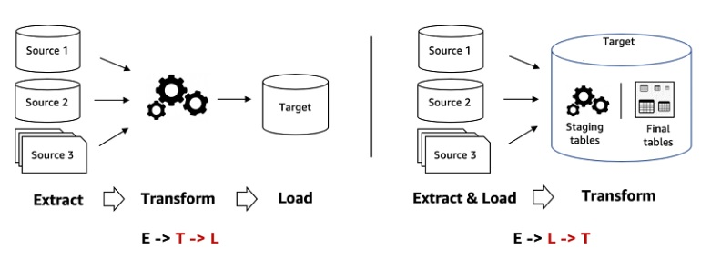 | A traditional approach focusing on Extract, Transform, Load (ETL) or Extract, Load, Transform (ELT) processes. |
| 5. | Data Mesh | 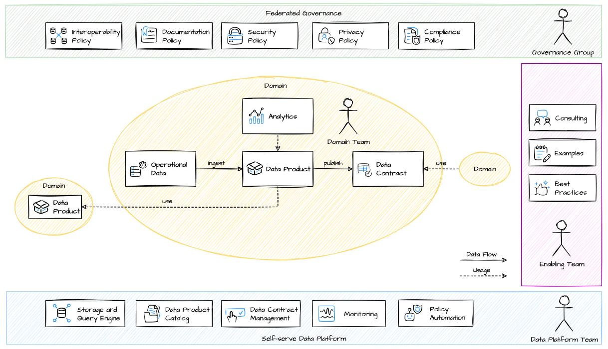 | A decentralized, domain-driven approach where each domain team manages its own data as a "product," promoting autonomy and self-service. |
| 6. | Event Driven | 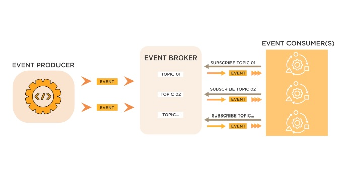 | - |
| 7. | Data Fabric | 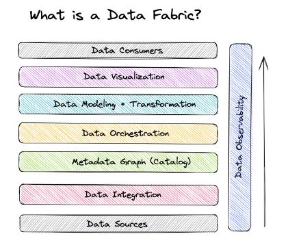 | - |

## __Teams Involved:-__

| __#__ | __Teams__ |
| --------- | --------- |
| 1. | Enterprise Architect. |
| 2. | Domain Architect. |
| 3. | Solutions Architect. |
| 4. | Platform Engineers. |
| 5. | Data Engineers. |
| 6. | Data Scientist. |

## __Summary Including the Flow of Teams Interactions:-__

| __#__ | __Teams__ | __Interaction__ | 
| --------- | --------- |  --------- |
| 1. | Enterprise Architect | Sets the strategic vision and ensures that all components align with the organization's objectives. | 
| 2. | Domain Architect | Focuses on domain-specific requirements, ensuring that the data architecture supports business needs and aligns with the vision of Enterprise Architect. |
| 3. | Solutions Architect | Translates the requirements from Enterprise and Domain Architect into data platform's Technical solutions. | 
| 4. | Platform Engineers | Builds the underlying infrastructure, providing the services and tools that the data engineering and data science teams require. |
| 5. | Data Engineers | Implements data pipelines and ensures that data is readily available and in the required state for analysis. |
| 6. | Data Scientist | Extracts insights and builds predictive models using the data made available by the Data Engineer. |

## __ETL vs ELT:-__

| __ETL (Extract Transfer and Load)__ |
| --------- |
| 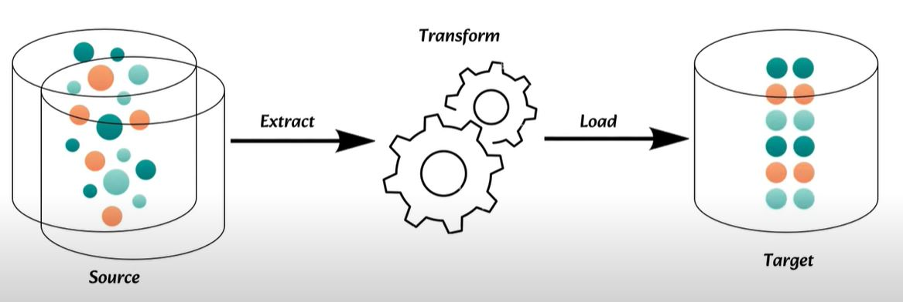 |
| Data is Extracted from Source System and Business Logic/Transformation is applied to it. |
| Processed Data is loaded into Data Warehouse for consumption. |

| __ELT (Extract Load and Transfer)__ |
| --------- |
| 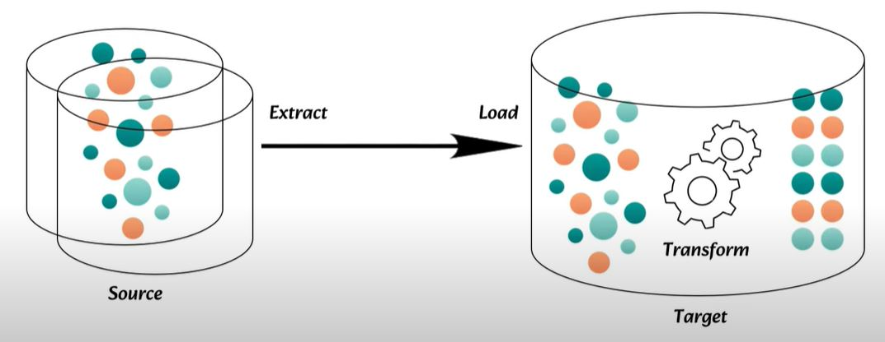 |
| This is a mordern Approach. |
| Data is Extracted from Source System and loaded in Data Warehouse in Raw Format. |
| Tranformation is carried out in Data Warehouse it-self. |

## __Factors Contributing to Shift from ETL to ELT:-__

| # | __Factors__ | __Details__ |
| --------- |  --------- |  --------- |
| 1. | Cost Effective  | No Need of additional ETL Infrastructure and utilize the processing power of Cloud Data Warehouse. | 
| 2. | Scalability  | The Cloud Data Warehouse are highly Scalable and can be increased or decreased based on Consumption. | 
| 3. | Flexibility  | Allows Data Scientist to use tools and languages to process data in Cloud Data Warehouse. | 
| 4. | Faster Time-to-Insight  | Data can be made available for analysis more quickly for faster time to insight and decision making. | 
| 5. | Improved Data Governance | Maintains Data Lineage within Data Warehouse. |

__Note:-__

__Data Lineage:__ Process of tracking the movement and transformation of data from its source to its final destination. This Provides visibility into how data changes over time, ensuring transparency, accuracy, and traceability.

## __Azure Databricks Introduction:-__

| __#__ | __Details__ |
| --------- |  --------- |
| 1. | Cloud-based analytics platform. |
| 2. | Unifies data engineering, data science, and machine learning workflows on a single platform. |
| 3. | Offers scalable big data processing with Apache Spark. |
| 4. | Seamless Collaboration with other Azure CLoud Services. |
| 5. | Ensure Data Analysis Faster and efficient. |

## __Azure Databricks Networking:-__

| __#__ | __Details__ |
| --------- |  --------- |
| 1. | Reference URL - https://learn.microsoft.com/en-us/azure/databricks/security/network/classic/vnet-inject |
| 2. | The VNet and Azure Databricks workspace should reside in __Same Region and Subscription__. |
| 3. | The __Address Space__ of the VNet should be between /16 to /24. |
| 4. | __Two__ Subnets are required - Container Subnet (Also known as "Private Subnet") and Host Subnet (Also known as "Public Subnet"). Size of each Subnet is /26. |
| 5. |  Databricks does not recommend a subnet smaller than /26. |

| __#__ | __Purpose of Public Subnet__ |
| --------- |  --------- |
| 1. |  The public subnet is used to allow communication between the Databricks control plane and the cluster infrastructure. This inlcudes job scheduling, monitoring, and scaling the cluster. |
| 2. |  The Public subnet allows outbound internet traffic, providing clusters access to resources that are not present in the private network.  |
| 3. |  The public subnet is where managed public IP addresses are assigned to clusters if they need to communicate with services outside the VNet. |

| __Is it possible to setup Azure Databricks without Public Subnet ?__ | 
| --------- |
| To set up Azure Databricks without a public subnet, we will choose "No Public IP" feature along with private endpoints. This will then allow us to deploy a secure and private deployment of Azure Databricks within VNet. |

## __Terraform AzureRM Provider for Azure Databricks:-__

| Here you go: https://registry.terraform.io/providers/hashicorp/azurerm/latest/docs/resources/databricks_workspace |
| --------- |

## __Terraform Provider for Databricks:-__

| Here you go: https://registry.terraform.io/providers/databricks/databricks/latest/docs |
| --------- |

## __Azure Databricks Deployment using Terraform:-__

| Please Refer to:- https://github.com/arindam0310018/30-Sept-2024-Data__Azure-Databricks-Insights-from-a-Platform-Engineer/tree/main/Terraform/01-Azure-Databricks |
| --------- |

## __Build a Spark Cluster and Run a Sample Notebook:-__

Please Refer to:- https://github.com/arindam0310018/30-Sept-2024-Data__Azure-Databricks-Insights-from-a-Platform-Engineer/blob/main/Python/Hello-World.py

## __Mounting ADLSv2 to Databricks Cluster:-__

Please Refer to:- https://github.com/arindam0310018/30-Sept-2024-Data__Azure-Databricks-Insights-from-a-Platform-Engineer/blob/main/Python/Mount-Unmount-ADLS-Gen2.py

| __Reference Screenshots:-__ | 
| --------- |
| 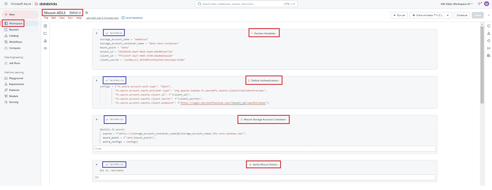 |
| 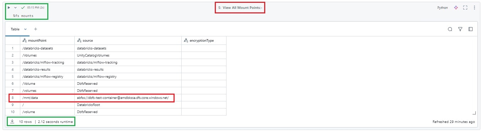 | 
| 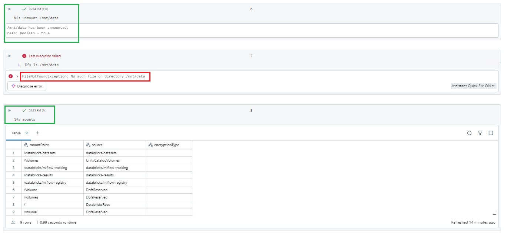 |

## __Workspace Backup:-__

Please Refer to:- https://github.com/arindam0310018/30-Sept-2024-Data__Azure-Databricks-Insights-from-a-Platform-Engineer/tree/main/Workspace-Backup

## __Connector for Azure Databricks:-__

| __Reference Screenshots:-__ | 
| --------- |
| Access Connector For Azure Databricks |
| 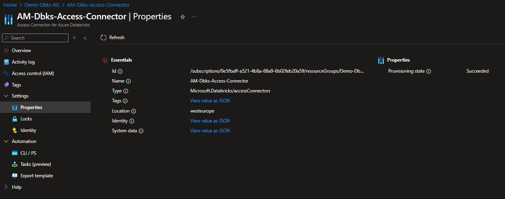 |
| 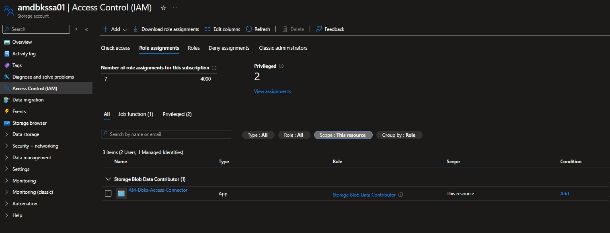 |
| __Terraform AzureRM Provider for Access Connector for Azure Databricks:__ https://registry.terraform.io/providers/hashicorp/azurerm/latest/docs/resources/databricks_access_connector |

## __Pre-Requisites for Unity Catalog:-__

| __#__ | __Pre-Requisites__ |
| --------- | --------- |
| 1. |  Account needs to have Global Administrator. |
| 2. |  SKU - Premium. |

## __Unity Catalog:-__

Unified data governance solution in Databricks that provides centralized access management, data lineage, and auditing across data assets, enabling secure, organized, and compliant data access across different data lakes and warehouses.

| __Reference Screenshots:-__ | 
| --------- |
| 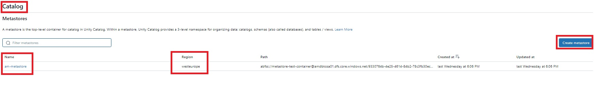 |
| 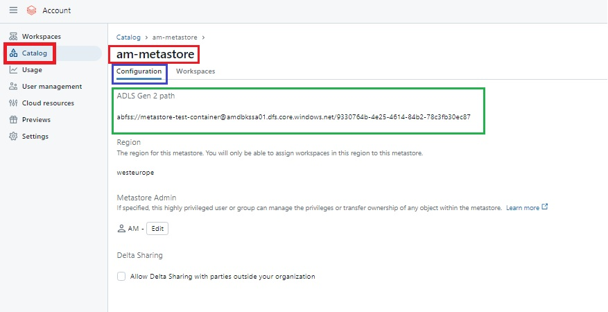 |
| 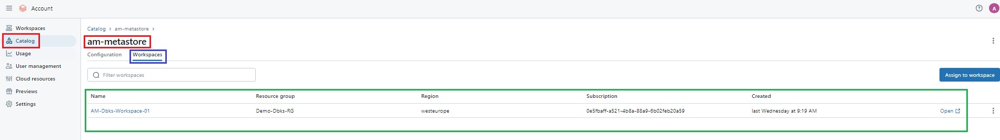 |

| __Important to Note:-__ | 
| --------- |
| 1. Access Unity Catalog from: https://accounts.azuredatabricks.net/ |
| 2. Only a single metastore per region is allowed. |

| __Enable Unity Catalog?__ |
| --------- |
| Assigning the metastore will update workspaces to use Unity Catalog, meaning that:- |
| 1. Data can be governed and accessed across workspaces. |
| 2. Data access and lineage is captured automatically. |
| 3. Identities are managed centrally at the account level (cannot be reversed). |

## __Azure Databricks SCIM Connector:-__

| __Important to Note:-__ | 
| --------- |
| 1. SCIM - System for Cross Domain Identity Management. |
| 2. Use the SCIM token and Account SCIM URL to set up integration in your identity provider. |
| 3. Follow the Option: https://accounts.azuredatabricks.net/ > Settings > User Provisioining > Setup user Provisioining. |
| 4. SCIM Token:  Token which will be used to perform user and group management operations. |
| 5. Account SCIM URL: Provide this URL to your identity provider when you enable the User Provisioning via SCIM Tokens. |
| 6. Follow the Option: Enterprise Application > Azure Databricks SCIM Provisioining Connector. |

| __Reference Screenshots:-__ | 
| --------- |
| 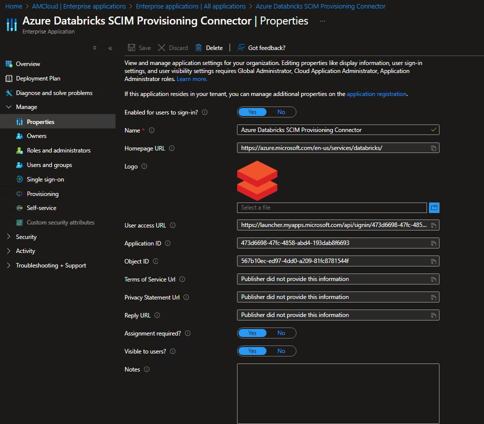 |
| 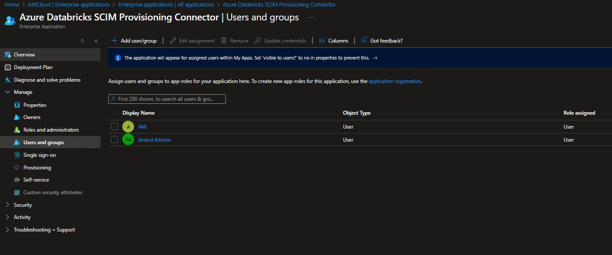 |
| 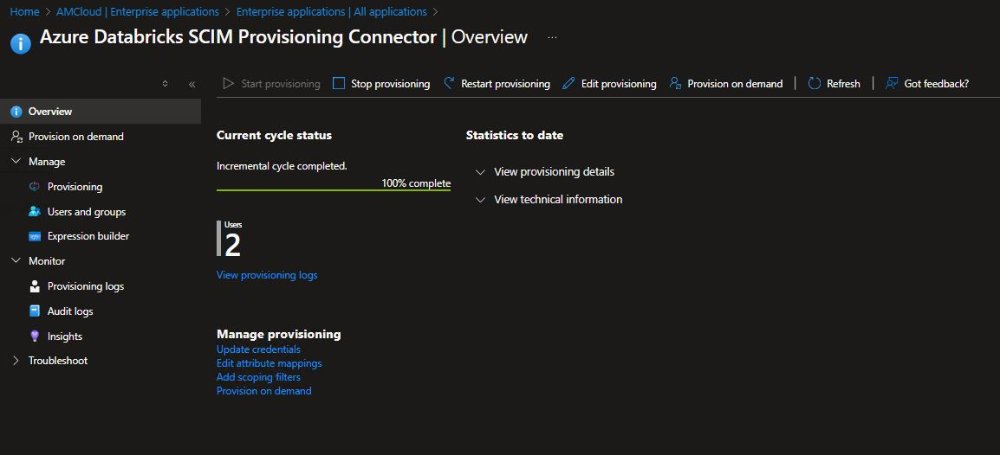 | 

## __Azure Databricks Repos:-__

| __What you CAN do:-__ | 
| --------- |
| 1. Clone, Push and Pull from Remote GIT Repo. |
| 2. Create and Manage Branches. |
| 3. Create and Edit Notebooks in the Branches. |
| 4. Compare differences upon Commit |

| __What you CANNOT do:-__ | 
| --------- |
| 1. Create Pull Request. |
| 2. Resolve Merge Conflict. |
| 3. Merge and Delete Branches. |
| 4. Rebase a branch. |
